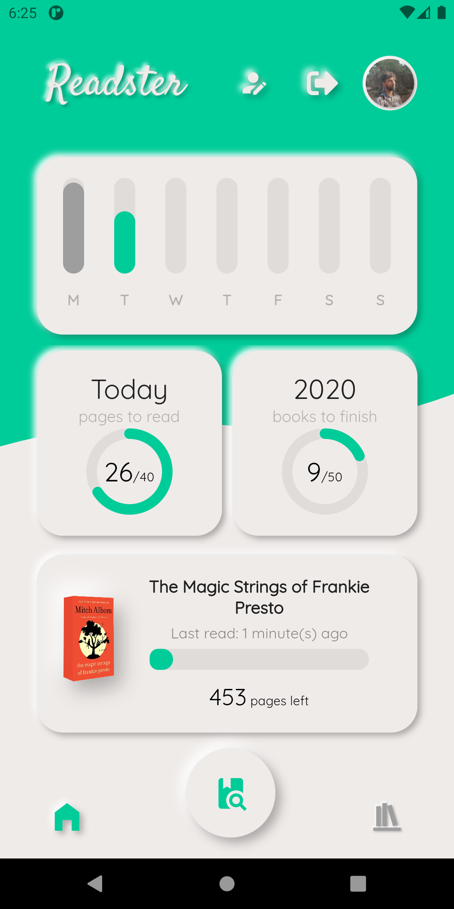
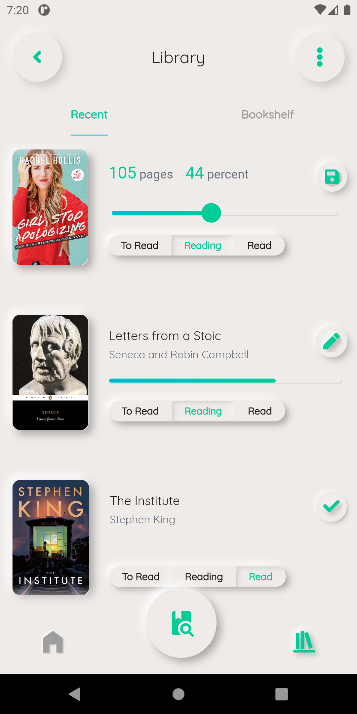
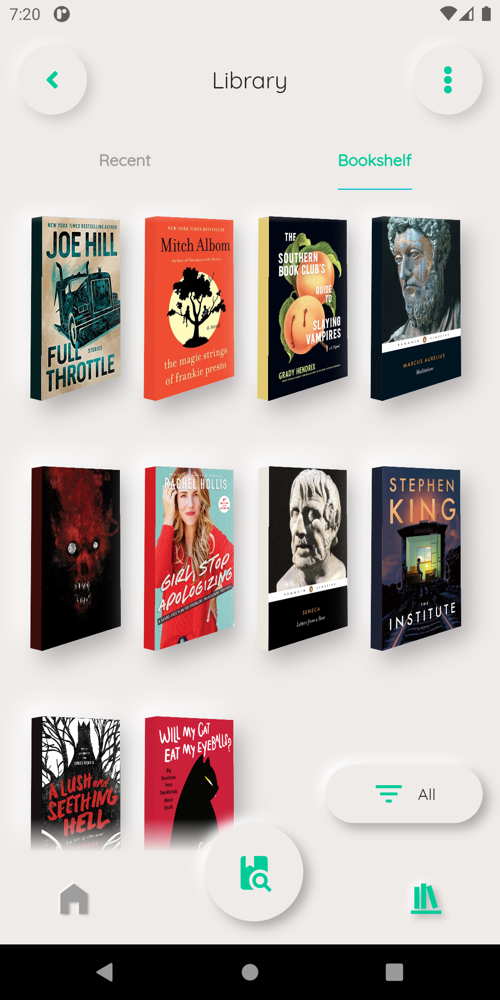
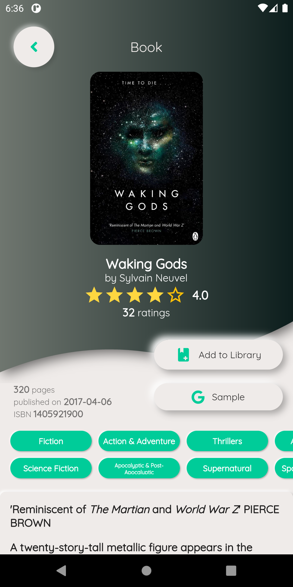
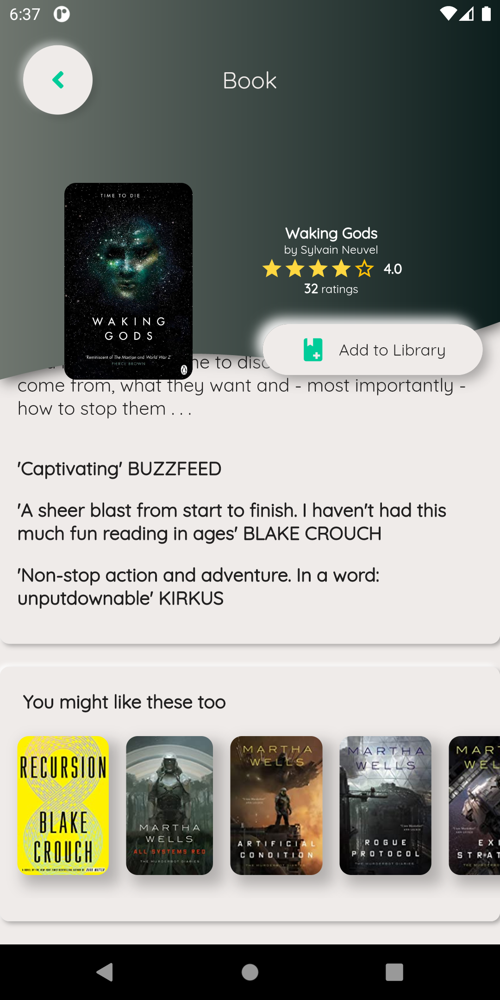
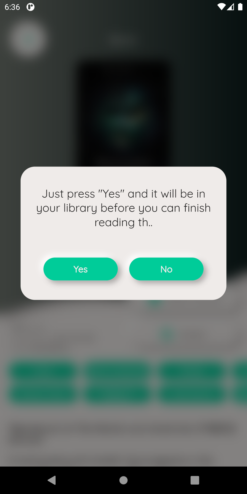
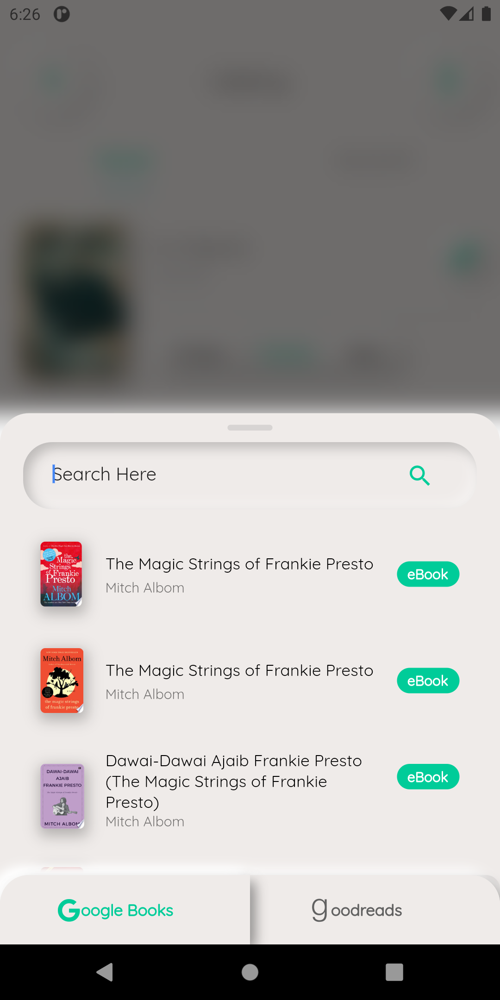
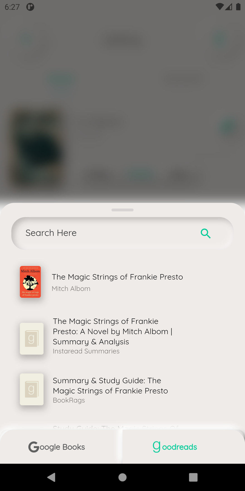

# Readster (still in development)

A minimal reading tracker app that aims to keep the bloat out and focus on what matters; your reading habit. Keep a virtual library of all your favourite books to sort through and update your reading progress as you go. Readster will do the rest.

##### This app is being built using Flutter

## Screenshots (as of Aug 18)

## Home

## Library

| Booklist     | Bookshelf      |
|------------|-------------|
|  |  |

## Details
| Scrollable details screen   |
|------------------------|
|  |

| Add to library     | eBook sample     |
|------------|-------------|
|  |  |

## Search
| Google Books     | Goodreads   |
|------------|-------------|
|  |  |
