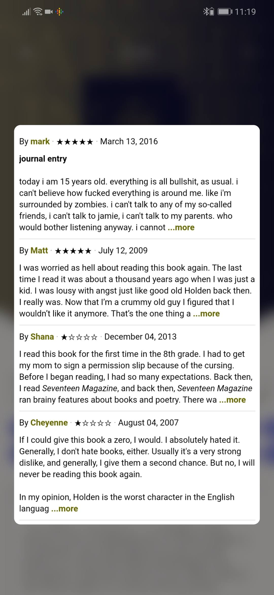
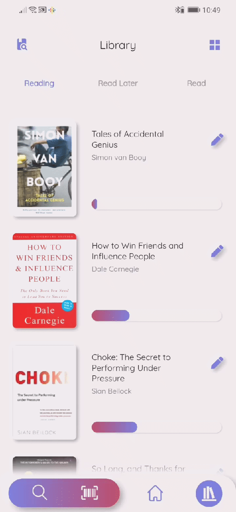
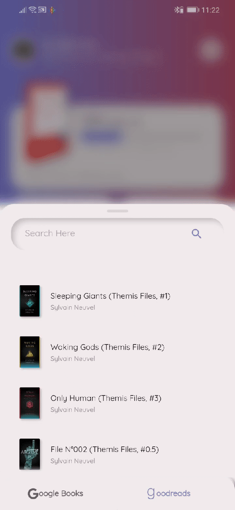

# Readster

A minimal digital bookmark app that aims to keep the bloat out and focus on what matters; your reading habit. Keep a virtual library of all your favourite books to sort through and update your reading progress as you go. 

##### This app was built using Flutter

## Screenshots (as of Sep 06, 2020)

## Library

| Booklist     | Bookshelf      |
|------------|-------------|
|  |  |

## Details

| Details screen | Goodreads reviews     | eBook sample     |
|------------|------------|-------------|
|   |  |  |

## Home

| Home screen    | Reminder      |
|------------|-------------|
|  |  |

## Search
| Google Books & Goodreads   | ISBN Scanner |
|------------|-------------|
|  |  |

